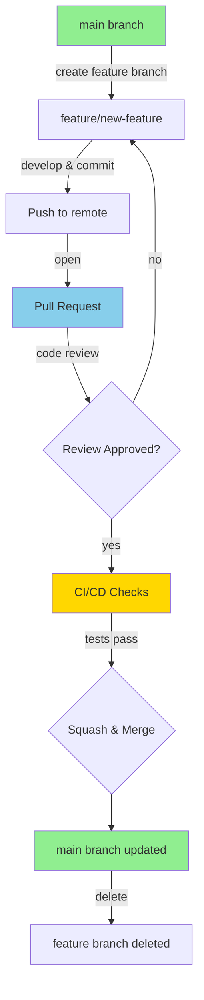
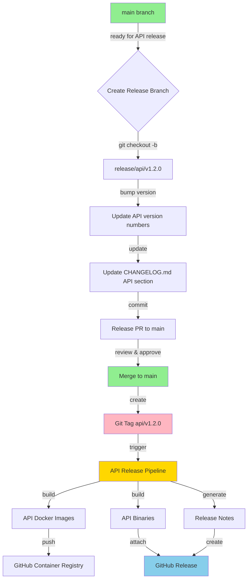
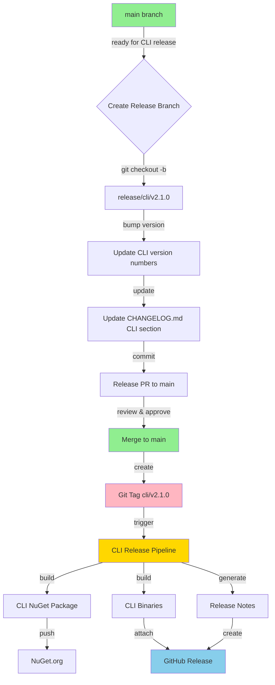
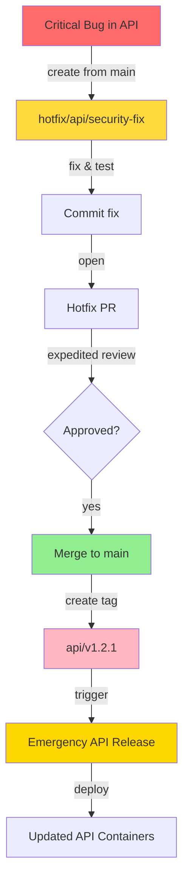
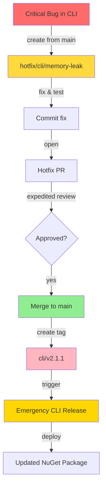

# Git Workflow & Release Process

This document outlines the Git workflow and release process for Lintellect, a self-hostable AI-powered code review assistant.

## Overview

Lintellect uses **GitHub Flow** with release branches for managing code changes and releases. The project consists of two main components that are released independently:

- **API** (`Lintellect.Api`) - REST API service with Docker deployment
- **CLI** (`Lintellect.Cli`) - Command-line tool published to NuGet

## Branch Strategy

### Main Branches

- **`main`** - Production-ready code, always stable and deployable

### Supporting Branches

- **`feature/*`** - New features (e.g., `feature/add-typescript-analyzer`)
- **`bugfix/*`** - Bug fixes (e.g., `bugfix/fix-api-crash`)
- **`hotfix/api/*`** - Critical API fixes (e.g., `hotfix/api/security-patch`)
- **`hotfix/cli/*`** - Critical CLI fixes (e.g., `hotfix/cli/memory-leak`)
- **`release/api/v*`** - API release preparation (e.g., `release/api/v1.2.0`)
- **`release/cli/v*`** - CLI release preparation (e.g., `release/cli/v2.1.0`)
- **`docs/*`** - Documentation updates (e.g., `docs/update-deployment-guide`)

## Versioning Strategy

### Independent Versioning

- **API**: Tagged as `api/v1.2.3` or `api-v1.2.3`
- **CLI**: Tagged as `cli/v2.1.0` or `cli-v2.1.0`

This allows:

- API and CLI to evolve at different paces
- Breaking changes in one without affecting the other
- Users to update components independently

### Semantic Versioning

Both components follow [Semantic Versioning](https://semver.org/):

- **MAJOR** - Breaking changes, incompatible API changes
- **MINOR** - New features, backward compatible
- **PATCH** - Bug fixes, backward compatible

## Development Workflow

### Feature Development Flow



**Steps:**

1. Create feature branch from `main`: `git checkout -b feature/add-caching`
2. Make commits with conventional commit messages
3. Push branch and open Pull Request
4. Automated checks run (build, test, coverage, security)
5. Code review by maintainer(s)
6. Squash and merge to `main`
7. Feature branch auto-deleted

### Commit Message Convention

Use **Conventional Commits** with component scope:

```
<type>(<component>/<scope>): <subject>

<body>

<footer>
```

**Types:**

- `feat` - New feature
- `fix` - Bug fix
- `docs` - Documentation changes
- `style` - Code style changes
- `refactor` - Code refactoring
- `perf` - Performance improvements
- `test` - Adding/updating tests
- `chore` - Build process, dependencies
- `ci` - CI/CD changes

**Components:**

- `api` - API changes
- `cli` - CLI changes
- `shared` - Shared models changes
- `docs` - Documentation
- `ci` - CI/CD changes
- `deps` - Dependencies

**Examples:**

```bash
feat(api): add job cancellation endpoint
fix(cli): resolve crash on invalid solution path
feat(cli/analyzer): add TypeScript support
docs(api): update deployment guide
chore(deps): update Anthropic.SDK to 5.9.0
```

## Release Process

### API Release Process



### CLI Release Process



### Release Decision Matrix

| Change Type         | API Release | CLI Release | Both |
| ------------------- | ----------- | ----------- | ---- |
| New AI analyzer     | ✅          | ❌          | ❌   |
| New CLI analyzer    | ❌          | ✅          | ❌   |
| Shared model change | ✅          | ✅          | ✅   |
| API endpoint change | ✅          | ❌          | ❌   |
| CLI flag change     | ❌          | ✅          | ❌   |
| Security fix in API | ✅          | ❌          | ❌   |
| Security fix in CLI | ❌          | ✅          | ❌   |

## Hotfix Process

### API Hotfix



### CLI Hotfix



## Pull Request Process

### PR Requirements

1. **Component Selection** - Specify which component(s) are affected
2. **Description** - Clear description of changes
3. **Testing** - Evidence of testing performed
4. **Breaking Changes** - Document any breaking changes
5. **Changelog** - Update CHANGELOG.md if needed

### PR Template

When creating a PR, use the provided template that includes:

- Component selection checklist
- Testing requirements
- Breaking change indicator
- Changelog update reminder

### Code Review Guidelines

- **At least 1 approval** required for merge
- **All CI checks must pass** before merge
- **No force pushes** to protected branches
- **Squash merge** to maintain linear history
- **Conversation resolution** required

## CI/CD Pipeline

### Complete Pipeline Flow

```mermaid
graph TB
    subgraph "Pull Request Workflow"
        PR[Pull Request Opened/Updated] --> CI1[Trigger CI Pipeline]
        CI1 --> BUILD[Build All Projects]
        BUILD --> UNIT[Run Unit Tests]
        UNIT --> INT[Run Integration Tests]
        INT --> FUNC[Run Functional Tests]
        FUNC --> LINT[Code Quality Checks]
        LINT --> SEC[Security Scan]
        SEC --> COV[Code Coverage Report]
        COV --> STATUS{All Checks Pass?}
        STATUS -->|Yes| APPROVE[Ready for Review]
        STATUS -->|No| FAIL[Block Merge]
    end

    subgraph "Main Branch Workflow"
        MERGE[Merged to main] --> CI2[Build & Test]
        CI2 --> DOCKER1[Build Docker Images]
        DOCKER1 --> PUSH1[Push to GHCR with 'main' tag]
    end

    subgraph "API Release Workflow"
        TAG1[Git Tag api/v*] --> CI3[API Release Pipeline]
        CI3 --> VER1[Extract Version]
        VER1 --> BUILD2[Build API Artifacts]

        BUILD2 --> DOCKER2[Build API Docker Images]
        BUILD2 --> BINS1[Create API Binaries]

        DOCKER2 --> TAG2[Tag: v1.2.0, latest, 1.2, 1]
        TAG2 --> GHCR[Push to GitHub Container Registry]

        BINS1 --> NOTES1[Generate Release Notes]
        NOTES1 --> GH1[Create GitHub Release]
    end

    subgraph "CLI Release Workflow"
        TAG3[Git Tag cli/v*] --> CI4[CLI Release Pipeline]
        CI4 --> VER2[Extract Version]
        VER2 --> BUILD3[Build CLI Artifacts]

        BUILD3 --> NUGET[Build NuGet Package]
        BUILD3 --> BINS2[Create CLI Binaries]

        NUGET --> NUGETORG[Publish to NuGet.org]
        BINS2 --> NOTES2[Generate Release Notes]
        NOTES2 --> GH2[Create GitHub Release]
    end

    style PR fill:#87CEEB
    style MERGE fill:#90EE90
    style TAG1 fill:#FFB6C1
    style TAG3 fill:#FFB6C1
    style APPROVE fill:#90EE90
    style FAIL fill:#FF6B6B
    style GH1 fill:#87CEEB
    style GH2 fill:#87CEEB
```



## Branch Protection Rules

The `main` branch is protected with the following rules:

- ✅ **Require pull request reviews** (1 approver minimum)
- ✅ **Require status checks to pass** before merging:
  - Build successful (API)
  - Build successful (CLI)
  - All tests passing
  - Code coverage ≥ 80%
- ✅ **Require conversation resolution**
- ✅ **Require linear history** (squash merge)
- ✅ **Restrict who can push** to matching branches
- ❌ **Do not allow force pushes**
- ❌ **Do not allow deletions**

## Version Management

### Version Locations

**API:**

- `src/Lintellect.Api/Lintellect.Api.csproj` - `<Version>` tag
- `Directory.Build.props` - Default version (can be overridden)

**CLI:**

- `src/Lintellect.Cli/Lintellect.Cli.csproj` - `<Version>` and `<PackageVersion>` tags

**Shared:**

- `src/Lintellect.Shared/Lintellect.Shared.csproj` - Version follows API

### Helper Scripts

Use the provided scripts to automate common tasks:

- `scripts/create-release-api.sh` - Create API release branch
- `scripts/create-release-cli.sh` - Create CLI release branch
- `scripts/create-hotfix-api.sh` - Create API hotfix branch
- `scripts/create-hotfix-cli.sh` - Create CLI hotfix branch
- `scripts/version-check.sh` - Verify version consistency

## Best Practices

### For Contributors

1. **Keep branches up to date** with main
2. **Write clear commit messages** following conventional commits
3. **Test your changes** thoroughly
4. **Update documentation** when needed
5. **Use descriptive branch names**

### For Maintainers

1. **Review PRs promptly** and thoroughly
2. **Ensure CI checks pass** before merging
3. **Follow semantic versioning** for releases
4. **Keep CHANGELOG.md updated**
5. **Communicate breaking changes** clearly

### For Releases

1. **Test thoroughly** before releasing
2. **Follow the release checklist**
3. **Communicate releases** to users
4. **Monitor for issues** after release
5. **Document any migration steps**

## Getting Help

- **Documentation**: Check the `docs/` directory
- **Issues**: Use GitHub Issues for bugs and feature requests
- **Discussions**: Use GitHub Discussions for questions
- **Contributing**: See `CONTRIBUTING.md` for detailed guidelines

---

This workflow ensures a smooth, automated, and safe development and release process for both the API and CLI components of Lintellect.
